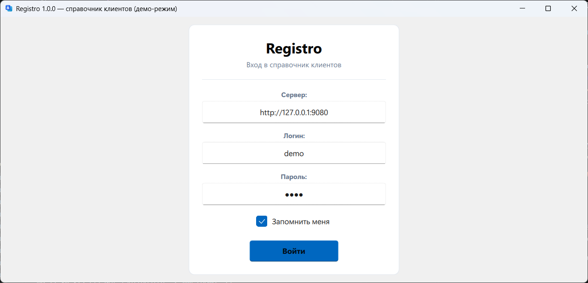
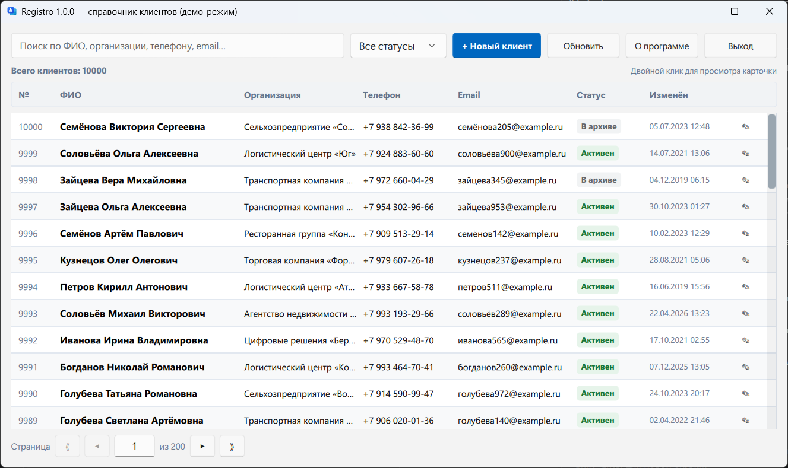
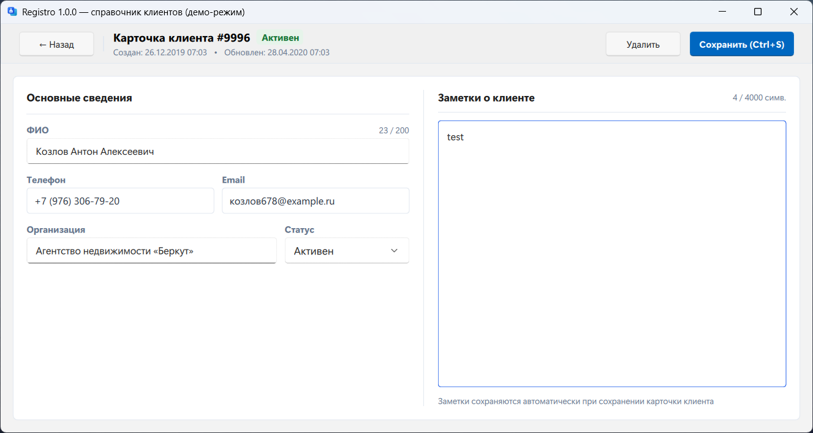

# RegistroExample

<p align="center">
  
  
  
  
  
</p>

<!-- GitHub badges (activate after the first push; replace <owner>/<repo>):
  /<repo>/ci.yml?label=CI&logo=github" alt="CI" />
  /<repo>?label=Release" alt="Release" />
-->

Пример клиент-серверного справочника клиентов на Qt 6.8.3, где QML-клиент через общий JSON-контракт общается с REST-сервером на QHttpServer, данные хранятся в SQLite, а три слоя кода связаны строгими зависимостями без единой внешней библиотеки, кроме самого Qt.

```
┌──────────────┐   REST / JSON   ┌──────────────┐   SQL   ┌────────────┐
│  QML-клиент  │ ──────────────► │ REST-сервер  │ ──────► │   SQLite   │
│  Qt Quick    │ ◄────────────── │ QHttpServer  │ ◄────── │   (WAL)    │
└──────────────┘                 └──────────────┘         └────────────┘
```

## Скриншоты

| Форма входа | Справочник клиентов | Карточка клиента |
|:---:|:---:|:---:|
|  |  |  |

## Возможности

- **Демо-режим по умолчанию** — обычный запуск создаёт `registro-demo.db` с учётной записью
  `demo`/`demo` и 10 000 случайных клиентов; клиент подставляет демо-данные в форму входа
  по своему конфигу (ключ `demo` в `config.ini`, по умолчанию включён — сервер не опрашивается).
  `--no-demo` запускает обычный сервер (`registro.db`, без сида).
- **Каталог клиентов** — CRUD, поиск, фильтр по статусу, пагинация по 50 записей;
  лимиты полей общие для сервера и клиента.
- **Заметки в карточке** — сохраняются атомарно вместе с карточкой, одним запросом.
- **Журнал аудита** — все изменения клиентов, доступен администратору.
- **Мягкое удаление** — через API записи не удаляются физически.
- **Логирование** — компактный однострочный формат, `--log-level/--log-file`.

## Архитектура

Три модуля со строгим направлением зависимостей: `common` ничего не знает о сторонах,
хранилище не выпускает SQL за пределы `Database`, QML общается с C++ через синглтоны модуля.

| Модуль | Содержимое |
|---|---|
| `src/common` | DTO и JSON-маппинг, лимиты полей, инфраструктура логирования |
| `src/server` | `Database` (SQL, миграции), `ApiServer` (маршруты, авторизация, аудит), конфигурация; приложение `RegistroServer` |
| `src/client` | `ApiClient`, модели списка и конфигурации; QML-приложение `RegistroClient` (синглтоны `Api`, `ClientModel`, `Config`, `Limits`, `Theme`) |

## API

Базовый URL: `http://<host>:9080`. Ответы — JSON; ошибки — `{"error": "message"}` с подходящим HTTP-кодом. «auth» — требуется заголовок `Authorization: Bearer <token>`; «admin» — только для роли `admin`. Пока в базе нет пользователей, API открыт (auth отключается), и первый созданный через `POST /api/users` пользователь принудительно получает роль `admin`. Другие способы создать первого админа: `--admin-user admin --admin-password <8+ символов>` при первом запуске plain-сервера (или ключи `admin_user`/`admin_password` в `registro-server.ini`); в демо-режиме админ `demo`/`demo` создаётся автоматически.

| Метод и путь | Доступ | Описание |
|---|---|---|
| `GET /api/health` | публично | `{"status": "ok"}`; в демо-режиме добавляется `"demo": true` |
| `POST /api/auth/login` | публично | `{username, password}` → `{token, user}`; неудачные попытки троттлятся (10/мин → 429) |
| `GET /api/auth/me` | auth | текущий пользователь `{id, username, role}` |
| `GET /api/users` | admin | список пользователей `{items: [...]}` |
| `POST /api/users` | admin | создать `{username, password (≥8), role: user\|admin}` → 201 |
| `GET /api/clients?search=&status=&limit=&offset=` | auth | список `{total, items}` (поиск регистронезависим, для кириллицы тоже; телефон ищется по цифрам; пагинация по 50) |
| `POST /api/clients` | auth | создать клиента: `full_name` (обязательно), `org?`, `phone?`, `email?`, `notes?`, `status?` → 201 |
| `GET /api/client?id=N` | auth | один клиент; 404 если нет |
| `PUT /api/client?id=N` | auth | обновить (тело как POST) |
| `DELETE /api/client?id=N` | admin | мягкое удаление (в список больше не попадает) |
| `GET /api/audit?limit=&offset=` | admin | журнал изменений `{total, items}` |

## Сборка и запуск

Требуется: Qt 6.8.3 `msvc2022_64`, VS Build Tools (C++), CMake ≥ 3.25, Ninja.

```powershell
$env:CMAKE_PREFIX_PATH = "<путь к Qt>"                   # например: F:\Dev\Qt\sdk\version\6.8.3\msvc2022_64
& .\scripts\run-vs.cmd cmake --workflow --preset ci      # конфигурация + сборка + тесты
& .\build\RegistroServer.exe --port 9080                 # обычный запуск = демо (по умолчанию)
& .\build\RegistroClient.exe                             # клиент подставляет demo/demo в форму входа
& .\build\RegistroServer.exe --port 9080 --no-demo       # обычный сервер (registro.db)
```

Рантайм Qt разворачивается рядом с каждым исполняемым файлом, поэтому приложения из `build/`
работают автономно — без PATH и файлов окружения. Упаковка релиза (zip + windeployqt):
`.\scripts\release.ps1`.

## Конфигурация

**Сервер** — `registro-server.ini` рядом с исполняемым файлом (находится автоматически) или
`--config <путь>`; `--write-config <путь>` генерирует шаблон с комментариями. Приоритет:
встроенные значения по умолчанию < INI < флаги командной строки (`--port`, `--log-level`,
`--log-file`, `--db`, `--admin-user/--admin-password`, `--demo/--no-demo`). Встроенный
дефолт — демо-режим.

**Клиент** — настройки в файле `config.ini` в папке данных приложения (создаётся
автоматически): адрес сервера, последний логин, «запомнить меня». Токен сохраняется только
при согласии пользователя; пароль не хранится никогда. Ключ `demo` (по умолчанию `true`)
включает префилл формы входа демо-данными и суффикс «(демо-режим)» в заголовке окна.
Адрес сервера можно поменять прямо на форме входа.

## Проверка

```powershell
& .\scripts\run-vs.cmd ctest --preset debug      # все тестовые наборы
```

| Критерий | Состояние |
|---|---|
| Наборы QtTest (юнит + интеграция с реальным HTTP) | зелёные |
| qmllint (строгий режим) | 0 предупреждений |
| MSVC `/W4`, ASAN, `/analyze` | 0 предупреждений / зелёные |

## Структура

```
assets/        иконки (SVG/ICO), скриншоты
src/common/    общий REST-контракт и логирование (Qt::Core)
src/server/    хранилище, маршруты, конфигурация, авторизация; RegistroServer
src/client/    HTTP-контроллер, модели, настройки; QML-представления
tests/         8 наборов QtTest + проверка qmllint
scripts/       сборка, форматирование, бенчмарк, релизная упаковка
docs/          архитектурная документация
```

## Лицензия

[MIT](LICENSE)
